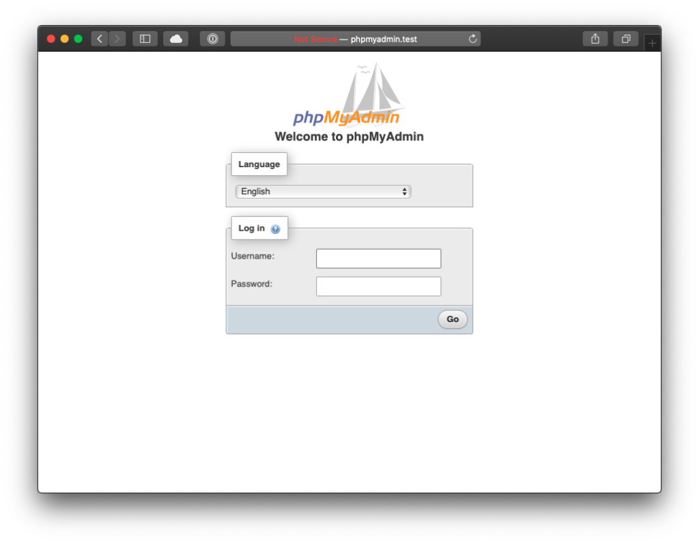
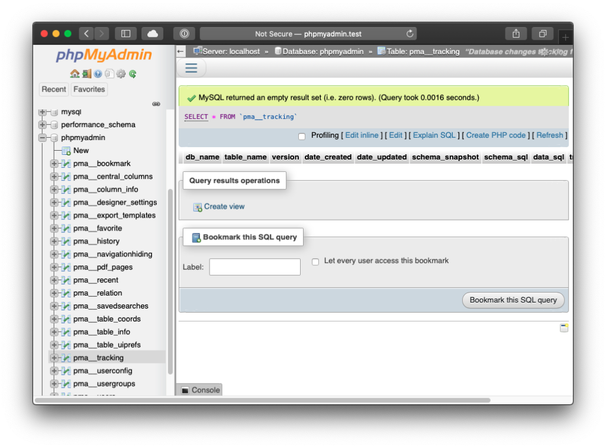

Have you ever wondered how to install the trusty **phpMyAdmin** to your homestead development box? The steps are quite simple, you just have to do the following:

#### Download phpMyAdmin

Pull the latest zip of phpMyAdmin source from [https://www.phpmyadmin.net/downloads/](https://www.phpmyadmin.net/downloads/) or directly the latest version (5.1.0) from [https://files.phpmyadmin.net/phpMyAdmin/5.1.0/phpMyAdmin-5.1.0-all-languages.zip](https://files.phpmyadmin.net/phpMyAdmin/5.1.0/phpMyAdmin-5.1.0-all-languages.zip) . Unpack it wherever it's most comfortable for you, and rename it as **phpMyAdmin**. For this example the final path is **~/Downloads/phpMyAdmin** .

#### Configure Homestead

Head to where Homestead is installed, and open **Homestead.yaml** in your favorite text editor.

```
---
ip: "192.168.22.10"
memory: 2048
cpus: 2
provider: virtualbox

authorize: ~/.ssh/id_rsa.pub

keys:
    - ~/.ssh/id_rsa

folders:
    - map: ~/Downloads/phpMyAdmin
      to: /home/vagrant/phpmyadmin

sites:
    - map: phpmyadmin.test
      to: /home/vagrant/phpmyadmin

databases:
    - homestead

features:
    - mariadb: false
    - ohmyzsh: true
    - webdriver: false
```

Set the folder and sites mapping as shown above, and save the file. Restart the vagrant instance with provision via the following command and wait till the image is restarted.

```
vagrant reload --provision
```

#### Update the hosts

On your host machine, the one that runs vagrant, head to the hosts file. For Unix systems ( Mac, Ubuntu, Arch, etc. ) it's at **/etc/hosts**.  
For Windows based machines it's at **C:\\Windows\\System32\\drivers\\etc\\hosts.** Open the file in a text editor with admin privileges ( or run with **sudo** from terminal ), and include the following line at the end of the file.  

```
192.168.22.10 phpmyadmin.test
```

And save the file. The selected address for this setup is **192.168.22.10** is the one specified in my **Homestead.yaml** file, under the **ip:** field. You can change your rule in the hosts file, to which ip is specified for your Homestead installation.

#### Usage

After all these steps, when you head to **phpmyadmin.test** in your browser, the application starts up as normal.



The default credentials for **Homestead**, as of version 12.0, are:

**Username:** homestead  
**Password:** secret



**Enjoy!**
